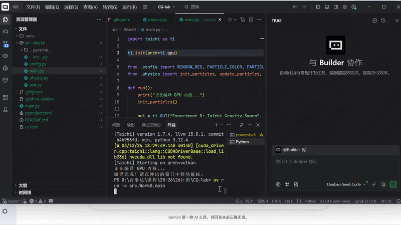

# CG-Lab1 - 粒子群交互系统

## 1. 项目简介
本项目是一个基于 **Taichi** 编程语言实现的 2D 粒子系统。通过 GPU 加速，实现了大量粒子（如 1000 个）的实时物理演算与渲染，并支持用户通过鼠标进行实时引力交互。

## 2. 效果展示
下面是本项目的运行效果展示（鼠标移动会吸引周围粒子）：

 

## 3. 项目架构与代码逻辑
本项目采用了模块化的 `src` 布局，主要结构如下：
- `src/Work0/config.py`: **参数配置层**。统一定义了物理系统参数（如粒子总数、鼠标引力强度、空气阻力系数等）和渲染参数（窗口分辨率、粒子颜色等）。
- `src/Work0/physics.py`: **物理计算层**。负责核心的物理逻辑，利用 Taichi 的 `@ti.kernel` 进行并行计算，处理粒子的受力（引力、阻力）、速度更新以及边界碰撞反弹。
- `src/Work0/main.py`: **主程序与渲染层**。负责初始化 Taichi 环境 (Vulkan/CUDA)，创建 GUI 窗口，处理鼠标输入事件，并循环调用物理计算和渲染函数。

## 4. 实现功能
- **海量粒子模拟**：基于 Taichi 实现了高性能的粒子运动学模拟。
- **实时键鼠交互**：获取鼠标当前坐标，实时计算鼠标对粒子的引力。
- **边界碰撞处理**：粒子触碰到窗口边缘时会发生动量损耗并反弹。
- **阻力衰减**：模拟空气阻力，使粒子运动更加真实自然。

## 5. 运行方式
本项目使用 `uv` 进行依赖管理。在根目录下执行以下命令即可运行：
```bash
uv run -m src.Work0.main
