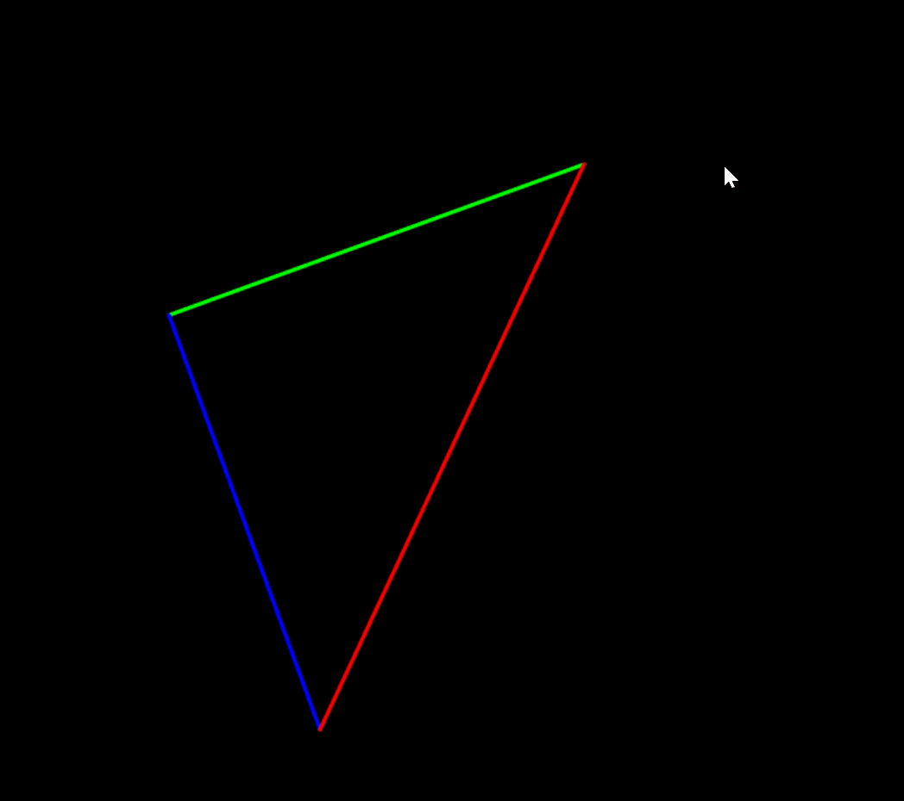
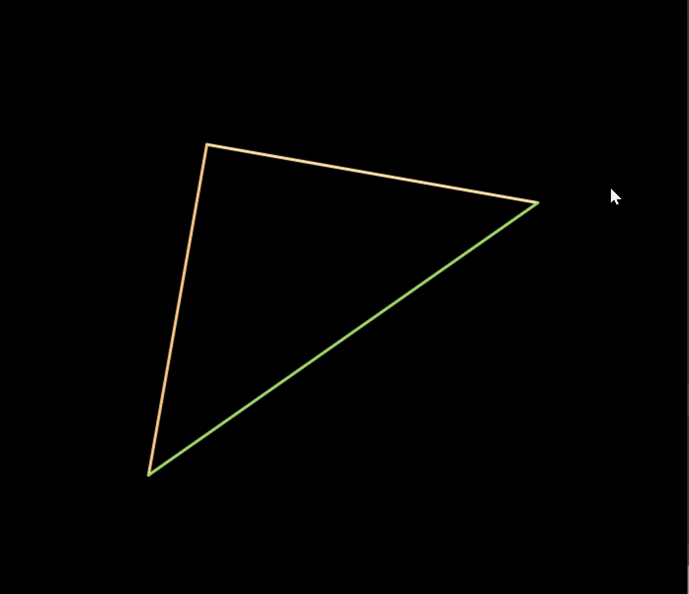
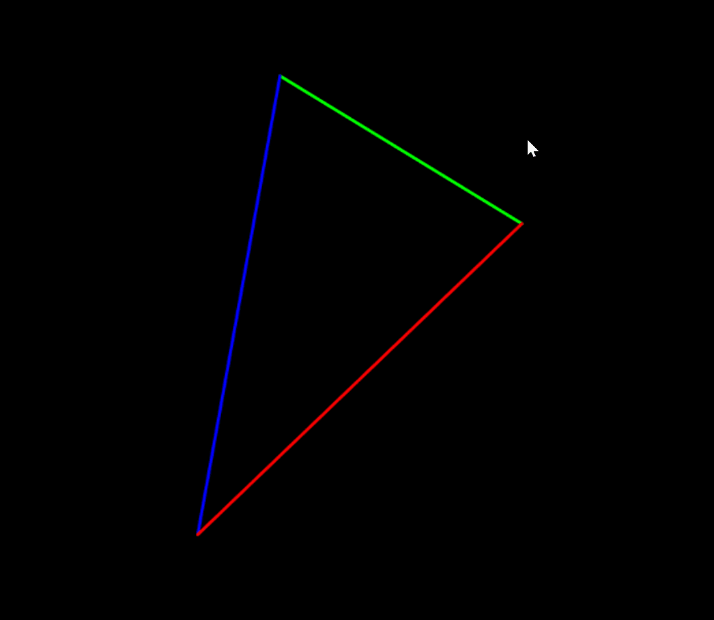
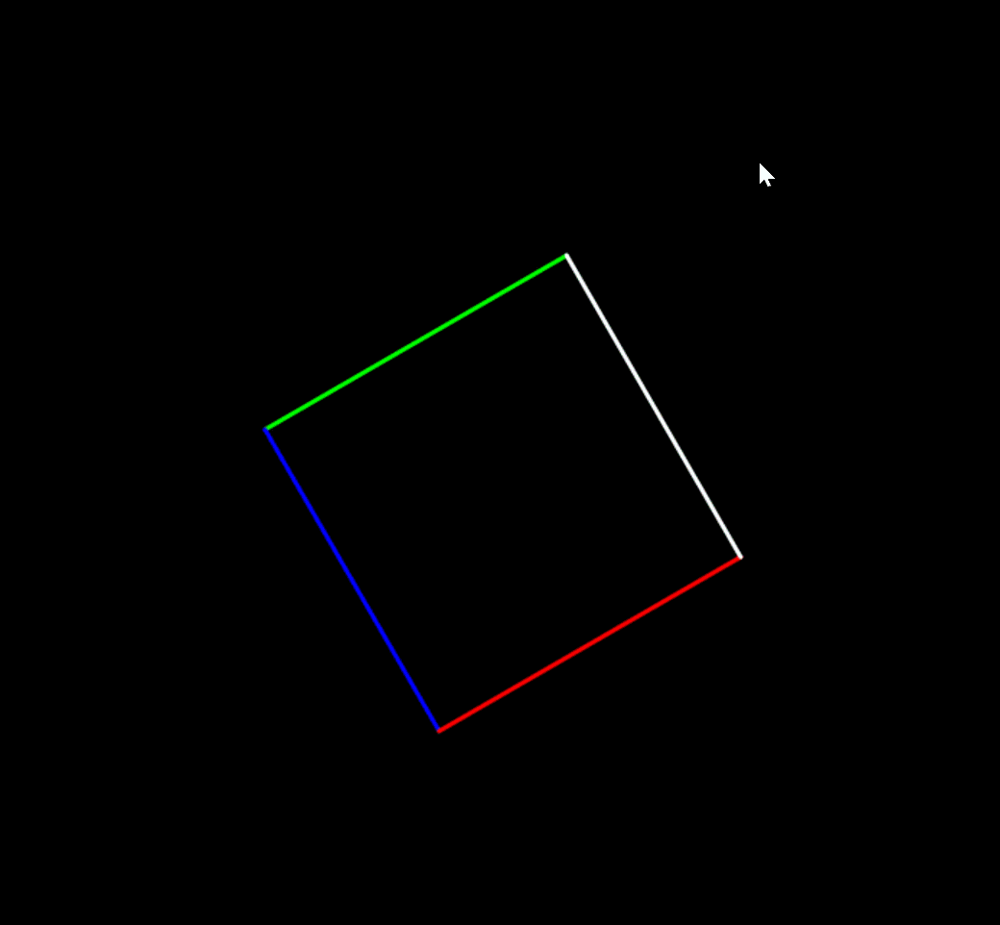

# CG-Lab1-3D Transformation

## 1.项目简介

本项目基于 **Taichi** 图形框架和 **NumPy** 实现了一个基础的 3D 变换渲染管线。通过手动构建 MVP 矩阵，将三维空间中的几何图元投影到二维屏幕上进行显示，并支持通过键盘交互实时旋转图形。

核心内容包括：
- **模型变换（Model）**：绕 Z 轴的旋转矩阵
- **视图变换（View）**：基于相机位置的视图矩阵
- **投影变换（Projection）**：透视投影矩阵

## 效果展示

### Demo 1：原始三角形

默认渲染的三角形，支持键盘 A/D 旋转。



### Demo 2：修改颜色

修改三角形三条边的颜色配置。



### Demo 3：修改三角形形状

通过调整顶点坐标改变三角形的形状。



### Demo 4：修改形状为正方形

将顶点扩展为四个，渲染为正方形。



## 项目架构

```
Work1/
├── _init_.py        # 模块初始化文件
├── config.py        # 配置参数（窗口、相机、顶点、颜色）
├── transform.py     # MVP 矩阵变换核心实现
├── main.py          # 主程序入口与渲染循环
├── cg_work1_demo1.gif  # Demo 1 效果图
├── cg_work1_demo2.gif  # Demo 2 效果图
├── cg_work1_demo3.gif  # Demo 3 效果图
└── cg_work1_demo4.gif  # Demo 4 效果图
```

| 文件 | 职责 |
|------|------|
| `config.py` | 定义窗口分辨率、相机参数、三角形顶点坐标和颜色常量 |
| `transform.py` | 实现三个变换矩阵：`get_model_matrix`（旋转）、`get_view_matrix`（视图）、`get_projection_matrix`（透视投影） |
| `main.py` | 初始化 Taichi、创建 GUI 窗口、处理键盘事件、执行 MVP 变换流水线并绘制图形 |

## 实现功能

- **MVP 矩阵变换流水线**：手动实现 Model、View、Projection 三个变换矩阵并完成矩阵级联
- **透视投影**：采用透视→正交的分解方法，先将视锥体压缩为长方体，再进行正交投影
- **NDC 归一化**：齐次坐标除以 w 分量完成透视除法，映射到归一化设备坐标
- **屏幕映射**：将 NDC 坐标 [-1, 1] 映射到屏幕坐标 [0, 1]
- **实时交互旋转**：按 `A` 键逆时针旋转 5°，按 `D` 键顺时针旋转 5°，按 `ESC` 退出
- **线框渲染**：使用不同颜色绘制几何图元的各条边

## 运行方式

### 运行程序

在项目根目录（`CG-lab/src`）下执行：

```bash
uv run -m src.Work1.main
```

### 键盘操作

| 按键 | 功能 |
|------|------|
| `A` | 逆时针旋转 5° |
| `D` | 顺时针旋转 5° |
| `ESC` | 退出程序 |
