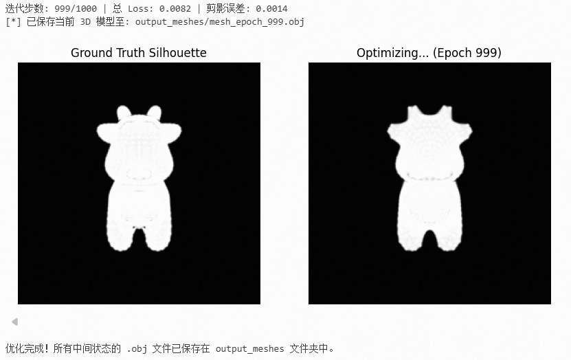
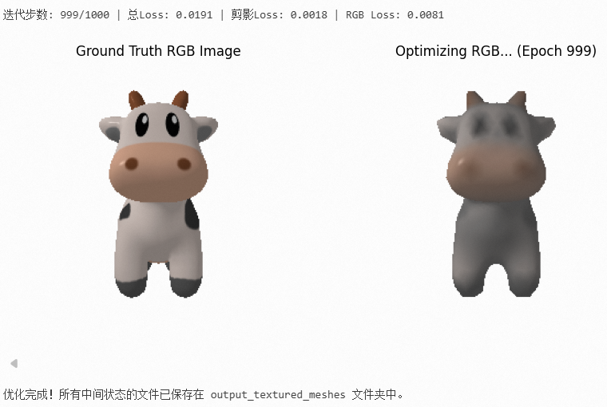

# CG-Lab5 — Differentiable Mesh Deformation via Silhouette Optimization

## 1. 项目简介

本实验基于 **PyTorch3D** 的可微渲染管线，利用**多视角剪影 (Silhouette)** 作为监督信号，从零开始将单位球面形变为目标三维模型（奶牛 `cow.obj`）。核心思想是：如果从各个角度看，一个 mesh 的投影轮廓都与目标一致，那么 mesh 本身的形状也必然逼近目标。


*Ground Truth：要捏成的目标三维模型*

核心亮点：

- **多视角剪影监督**：从 20 个均匀环绕的固定视角渲染目标和当前 mesh 的剪影，用 MSE 驱动形变。
- **三大网格正则化**：Laplacian Smoothing（防止顶点噪声）、Edge Loss（惩罚边长不均匀，压制尖刺）、Normal Consistency（惩罚相邻面法向量跳变，消除表面凹凸），三者配合保证 mesh 光滑。
- **参数调优经验**：正则化权重需要精细平衡——太弱则出现毛刺/凹凸，太强则细节被磨平。最终采用 `1.0 / 1.0 / 0.1` 的权重配比，epochs 提升至 1000。
- **选做 — 纹理联合优化**：在形状优化的同时学习顶点颜色，使用 SoftPhong 渲染器比对 RGB 图像，输出**带有顶点颜色的 .ply 文件**。颜色通过 `TexturesVertex` 参数化，与顶点坐标一起被梯度更新。

## 2. 效果展示

### 必做实验（Cell 1）：剪影驱动 mesh 形变


*Notebook 运行结果截图：左为 Ground Truth 剪影，右为当前优化中的预测剪影。经过 1000 轮迭代后剪影轮廓与目标几乎一致。*


*MeshLab 动画：从 ico_sphere(4) 出发逐步形变为奶牛，表面在三个正则项的约束下保持光滑。*

### 选做实验（Cell 2）：形状 + 纹理联合优化


*Notebook 运行结果截图：左为 Ground Truth RGB 渲染图，右为当前优化的预测 RGB 渲染图。形状与颜色同时从球体收敛到奶牛。*


*MeshLab 动画：联合优化顶点颜色，从灰色球体变为带有 RGB 纹理信息的彩色奶牛网格。*

## 3. 项目架构

```text
Work5/
├── data/                  # 项目数据
|   ├── cow.obj            # 目标三维模型
|   ├── cow.mtl            # 材质文件
|   └── cow_texture.png    # 贴图文件
├── output_meshes/         # 剪影驱动 mesh 形变的 .obj 中间结果
├── output_textured_meshes/# 形状 + 纹理联合优化的 .ply 彩色中间结果
├── Work5.ipynb            # 主实验 Notebook（3 个 cell）
├── visualization/         # 视觉三维演示结果
└── README.md              # 项目说明文档
```

| Cell | 职责 |
|------|------|
| Cell 0 | 环境安装：pip 升级 + PyTorch3D 从 Gitee 源码编译安装。 |
| Cell 1 | 纯剪影驱动的 mesh 形变优化，从 `ico_sphere(4)` 出发变形为目标奶牛形状。 |
| Cell 2 | 形状 + 顶点颜色联合优化，使用 SoftPhong Shader 监督 RGB 渲染，输出彩色 `.ply` 文件。 |

## 4. 实现功能

### 1. 加载目标模型并生成 Ground Truth 剪影

```python
verts, faces, _ = load_obj("cow.obj")
verts = (verts - verts.mean(0)) / max(verts.abs().max(0)[0])  # 归一化到单位球范围
cow_mesh = Meshes(verts=[verts], faces=[faces_idx])

# 20 个环绕摄像机
cameras = FoVPerspectiveCameras(
    R=look_at_view_transform(2.7, torch.zeros(num_views), torch.linspace(-180, 180, num_views))[0],
    T=look_at_view_transform(2.7, torch.zeros(num_views), torch.linspace(-180, 180, num_views))[1]
)
# SoftSilhouetteShader 渲染剪影（取 alpha 通道）
target_silhouette = shader(rasterizer(cow_mesh.extend(num_views)), cow_mesh.extend(num_views))[..., 3]
```

- 20 个视角均匀分布在 360° 水平环绕，`elev=0, dist=2.7`。
- `SoftSilhouetteShader` 使用 sigmoid 近似的软边界（`sigma=1e-4`），确保梯度可流回顶点。

### 2. 从球体出发进行可微形变优化

```python
src_mesh = ico_sphere(4, device)                              # 2562 顶点的单位球
deform_verts = torch.zeros_like(src_mesh.verts_packed(), requires_grad=True)
optimizer = torch.optim.SGD([deform_verts], lr=1.0, momentum=0.9)
```

- 使用 `ico_sphere(4)` 作为初始 mesh（正二十面体细分 4 次，2562 个顶点，5120 个面）。
- 优化的是顶点**偏移量**而非绝对坐标，初始偏移为 0 → mesh 初始为球体。
- SGD + momentum 提供稳定的收敛。

### 3. 组合损失函数与正则化调参

```python
loss = loss_silhouette + \
       1.0 * mesh_laplacian_smoothing(new_src_mesh) + \
       1.0 * mesh_edge_loss(new_src_mesh) + \
       0.1 * mesh_normal_consistency(new_src_mesh)
```

| 损失项 | 用途 | 调参经验 |
|--------|------|----------|
| `loss_silhouette` (MSE) | 驱动剪影匹配目标 | 核心监督信号 |
| `mesh_laplacian_smoothing` (1.0) | 每个顶点向邻居平均位置靠拢 | 值越大 mesh 越光滑，但过大会磨平细节（如牛角、牛腿） |
| `mesh_edge_loss` (1.0) | 惩罚边长差异，防止出现长条尖刺 | **杀毛刺关键**，从 0.1 提到 1.0 后表面毛刺基本消除 |
| `mesh_normal_consistency` (0.1) | 惩罚相邻面法向量夹角 | **消表面凹凸关键**，从 0.01 提到 0.1 后表面连续平滑 |

> **注意**：剪影 loss 只看轮廓，不管表面内部。如果没有足够强的正则化，顶点会在表面上下乱漂（形成凹凸/尖刺），而剪影 loss 完全察觉不到。三个正则项需要足够强才能压制剪影过拟合。

### 4. 纹理颜色联合优化

在形状优化的基础上，新增**顶点颜色**作为可学习参数：

```python
sphere_verts_rgb = torch.full([1, verts_shape[0], 3], 0.5, device=device, requires_grad=True)
optimizer = torch.optim.SGD([deform_verts, sphere_verts_rgb], lr=1.0, momentum=0.9)

# 使用 SoftPhongShader 渲染 RGB
phong_renderer = MeshRenderer(
    rasterizer=MeshRasterizer(cameras=cameras, raster_settings=raster_settings_rgb),
    shader=SoftPhongShader(device=device, cameras=cameras, lights=lights)
)
target_rgb = phong_renderer(cow_mesh.extend(num_views))[..., :3]
pred_rgb = phong_renderer(new_src_mesh.extend(num_views))[..., :3]
loss_rgb = ((pred_rgb - target_rgb) ** 2).mean()

# 联合 loss
loss = loss_silhouette + loss_rgb + 正则项
```

- 学习率与形状参数保持一致（`lr=1.0`）。
- 颜色通过 `torch.clamp` 限制在 `[0, 1]`，防止过冲。
- 最终输出**自定义 .ply 文件**（`save_colored_ply`），包含顶点坐标 + RGB 颜色。

## 5. 实验原理回顾

本实验利用**可微渲染 (Differentiable Rendering)** 的核心思想：

1. **前向渲染**：给定当前 mesh，经过 rasterizer + shader 渲染出剪影图和 RGB 图。
2. **Soft 近似**：标准光栅化是硬边界的,像素要么在三角形内要么不在，梯度为 0。`SoftSilhouetteShader` 使用 sigmoid 函数 ,`sigma` 控制软硬程度，将边界变模糊，使得"像素是否在三角形内"对顶点位置可导。
3. **反向传播**：剪影误差通过渲染管线的每一个可微操作反向传播回顶点坐标，告诉每个顶点如何移动才能让轮廓更匹配。
4. **迭代优化**：SGD 逐步调整顶点偏移量，使球体逐渐形变为目标形状。

本质上是**像素空间的看图建模**——仅凭 20 张剪影图像就能重建出三维形状。

## 6. 运行方式

### 环境要求

- Python 3.8+
- `torch >= 1.9`
- CUDA（GPU 强烈推荐，CPU 也可但极慢）

### 安装依赖

Notebook 的 Cell 0 已包含安装命令，或手动执行：

```bash
pip install --upgrade pip
pip install fvcore iopath matplotlib ninja
pip install "git+https://gitee.com/hongwenzhang/pytorch3d.git" --no-build-isolation
```

### 运行实验

在 Jupyter Notebook / VS Code 中打开 `Work5.ipynb`，按顺序执行三个 Cell：

1. **Cell 0** — 安装依赖（仅首次需要）
2. **Cell 1** — 必做实验：剪影驱动 mesh 形变
3. **Cell 2** — 选做实验：形状 + 颜色联合优化

### 结果查看

- 必做结果：`output_meshes/` 目录下的 `.obj` 文件，可用 **MeshLab** 打开并播放动画（File → Open as sequence）。
- 选做结果：`output_textured_meshes/` 目录下的 `.ply` 文件，包含顶点颜色，同样可用 MeshLab 查看。
