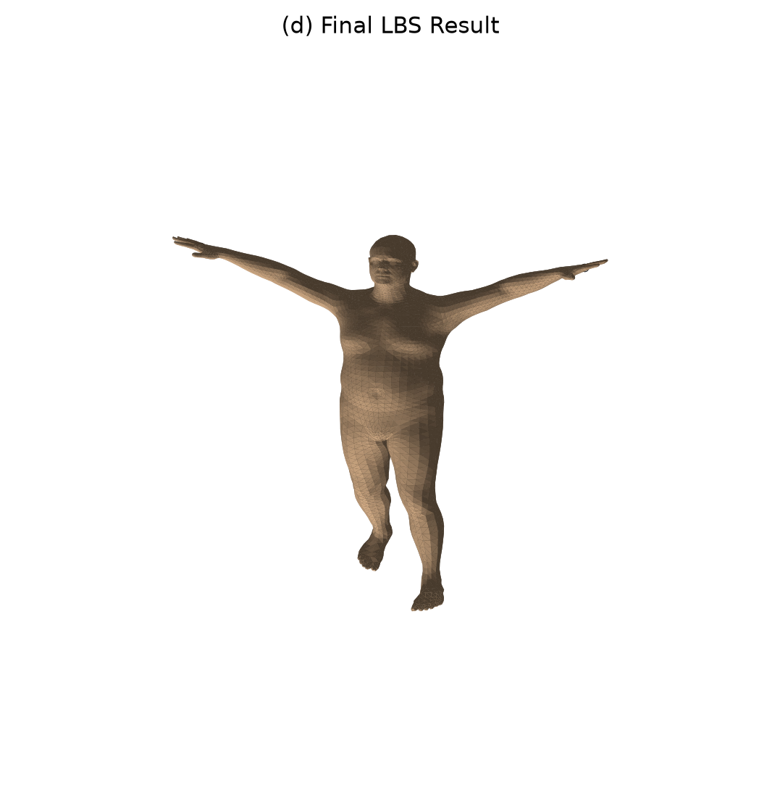
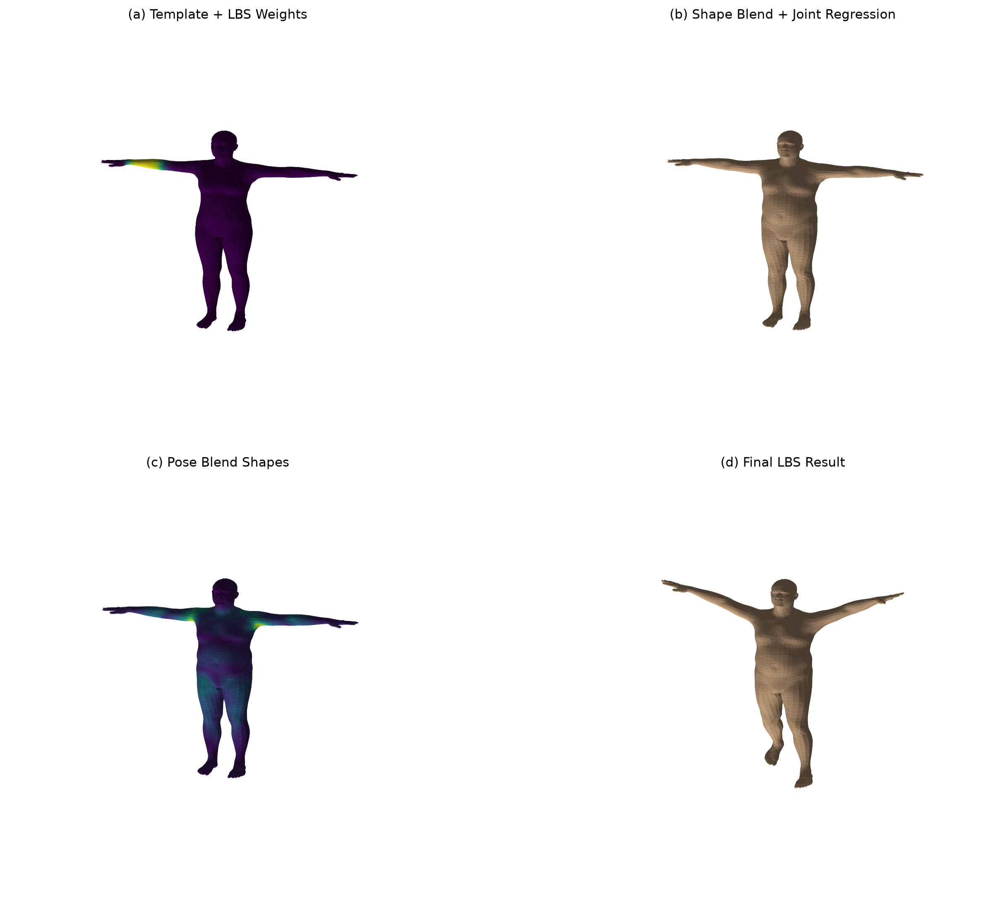
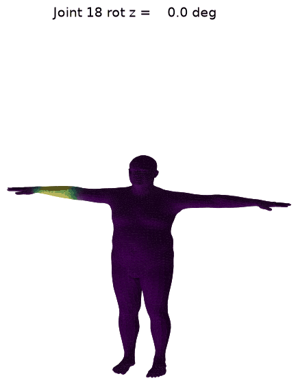

# CG-Lab7 - LBS 蒙皮

## 1. 实验简介

本实验基于 **SMPL** 参数化人体模型，完成一次完整的 **LBS** 蒙皮过程可视化。代码把 `smplx` 官方 `lbs()` 中的关键中间量拆出来单独计算，并分别保存模板网格、形状校正、姿态校正和最终蒙皮结果。

核心模块：

- **SMPL 模型加载**：读取当前目录下的 `SMPL_NEUTRAL.pkl`，输出顶点数、面片数、关节数和 betas 维度。
- **蒙皮权重可视化**：从 `lbs_weights` 中抽取指定关节权重，生成单关节热力图；同时生成全关节主导权重分布图。
- **形状校正与关节回归**：设置非零 `betas`，计算 `v_shaped = v_template + B_S(beta)`，再通过 `J_regressor` 回归关节 `J(beta)`。
- **姿态校正**：将轴角姿态转为旋转矩阵，构造 `pose_feature = R(theta) - I`，经 `posedirs` 得到 `pose_offsets`，形成 `v_posed`。
- **手写 LBS 验证**：使用关节层级刚体变换和 `lbs_weights` 手动混合每个顶点的 4x4 变换，并与 `smplx` 官方 forward 结果做误差对比。
- **姿态动画（选做）**：固定体型，让单个关节从 0 平滑旋转到目标角度，逐帧渲染并合成 GIF，直观观察蒙皮权重区域如何随骨骼平滑带动。

## 2. 效果展示

| Template + weights | Shape + joints |
| :---: | :---: |
|  |  |
| *模板网格与指定关节权重热力图* | *形状变化后的网格与回归关节* |

| Pose offsets | Final LBS result |
| :---: | :---: |
|  |  |
| *姿态校正位移大小分布* | *线性混合蒙皮后的最终姿态* |

| 2x2 阶段对比 | 全关节主导权重 |
| :---: | :---: |
|  |  |
| *LBS 四阶段对比* | *每个面片按主导关节着色* |

| 单关节姿态动画（选做） |
| :---: |
|  |
| *固定体型下左肘绕 z 轴 0°→110°，黄色高权重区域随前臂骨骼平滑摆动；权重本身不变，变的只是这些高权重顶点被骨骼带到的新位置* |

## 3. 项目架构

```text
Work7/
├── __init__.py              
├── main.py                  # SMPL 加载、手写 LBS、可视化、误差验证与选做动画
├── SMPL_NEUTRAL.pkl         # 本地 SMPL neutral 模型（较大，已 gitignore，需自行放置）
├── outputs/                 # 输出图片与摘要
│   ├── stage_a_template_weights.png
│   ├── stage_b_shaped_joints.png
│   ├── stage_c_pose_offsets.png
│   ├── stage_d_lbs_result.png
│   ├── comparison_grid.png
│   ├── all_joint_weights.png
│   ├── pose_animation.gif       # 选做：单关节姿态动画
│   ├── animation_frames/        # 选做：动画逐帧 PNG
│   └── summary.txt
└── README.md                # 项目说明文档
```

| 文件 | 职责 |
|------|------|
| `main.py` | 完成 SMPL 加载、五个核心中间量计算、LBS 结果生成、官方结果验证、图片保存，以及选做的单关节姿态动画。 |
| `outputs/*.png` | 对应实验任务要求的可视化结果。 |
| `outputs/pose_animation.gif`、`outputs/animation_frames/` | 选做内容：固定体型、单关节旋转的姿态动画及其逐帧图片。 |
| `outputs/summary.txt` | 记录模型基础信息、核心张量形状、手写 LBS 与官方结果误差，以及动画参数。 |

## 4. 实现功能

### 4.1 成功加载 SMPL

代码调用：

```python
model = smplx.create(
    model_path="./SMPL_NEUTRAL.pkl",
    model_type="smpl",
    gender="neutral",
    ext="pkl",
    num_betas=10,
)
```

运行结果：

| 项目 | 数值 |
|------|------|
| 顶点数 | 6890 |
| 面片数 | 13776 |
| 关节数 | 24 |
| betas 维度 | 10 |

为兼容旧版 SMPL pickle 中的 `chumpy.Ch` 对象，`main.py` 内实现了轻量级 pickle shim，因此不需要额外安装 `chumpy`。

### 4.2 模板网格与蒙皮权重

`v_template` 是 SMPL 的 T-pose 模板网格。每个顶点都有一组对 24 个关节的线性混合权重 `lbs_weights`。本实验默认选择 `joint_id = 18`，把该关节对所有顶点的影响权重映射为颜色并保存到：

```text
outputs/stage_a_template_weights.png
```

同时额外生成：

```text
outputs/all_joint_weights.png
```

这张图对每个面片按主导关节着色，颜色种类表示主要受哪个关节控制，颜色明暗表示主导权重强弱。

### 4.3 形状校正与关节回归

实验中设置非零形状参数：

```python
betas[0, 0] = 2.0
betas[0, 1] = -1.2
betas[0, 2] = 0.8
```

形状校正通过 `shapedirs` 的线性组合得到：

$$
v_{shaped} = v_{template} + B_S(\beta)
$$

关节不是固定常数，而是由形状变化后的网格回归得到：

$$
J(\beta) = J_{regressor} v_{shaped}
$$

输出文件：

```text
outputs/stage_b_shaped_joints.png
```

### 4.4 姿态校正

姿态参数采用轴角表示，先由 `batch_rodrigues()` 转为旋转矩阵，再构造姿态特征：

$$
pose\_feature = R(\theta) - I
$$

随后经 `posedirs` 线性映射到每个顶点的姿态校正偏移：

$$
pose\_offsets = pose\_feature \cdot posedirs
$$

最终得到：

$$
v_{posed} = v_{shaped} + pose\_offsets
$$

该阶段还没有做骨骼层级变换，只是在网格上加入姿态相关的 corrective blend shape。输出文件：

```text
outputs/stage_c_pose_offsets.png
```

### 4.5 线性混合蒙皮

最终 LBS 使用每个关节的全局刚体变换和顶点关节权重进行加权求和：

$$
v_i' = \sum_{k=1}^{K} w_{ik} G_k(\theta, J(\beta))
\begin{bmatrix}
v_i^{posed} \\
1
\end{bmatrix}
$$

实现步骤：

1. `batch_rigid_transform()` 根据运动学树计算 `J_transformed` 和每个关节的 4x4 变换矩阵 `A`。
2. 用 `lbs_weights` 对 `A` 加权，得到每个顶点自己的混合变换 `T`。
3. 把齐次坐标形式的 `v_posed` 乘以 `T`，得到最终顶点 `verts`。

输出文件：

```text
outputs/stage_d_lbs_result.png
outputs/comparison_grid.png
```

### 4.6 姿态动画（选做）

作为选做内容，`main.py` 还能生成一个简单的单关节姿态动画，用来直观展示**蒙皮权重区域如何随骨骼运动被平滑带动**。各项要求与实现的对应关系：

| 实验要求 | 实现方式 |
|----------|----------|
| 固定 shape 参数 | 复用 `build_demo_shape()` 得到的 `betas`，动画全程不变 |
| 让某一个关节从 0 逐渐旋转到某个角度 | `build_single_joint_pose()` 只对指定关节写入轴角，角度按 `np.linspace(0, max_angle, num_frames)` 均匀采样 |
| 生成若干帧图片，或导出 gif/mp4 | 每帧保存为 `outputs/animation_frames/frame_xxx.png`，再用 Pillow 合成 `outputs/pose_animation.gif` |
| 观察权重区域如何随骨骼运动平滑带动 | 网格按「该旋转关节自身的 `lbs_weights`」着色，高权重（黄/绿）区域正是被这根骨骼主导的表面 |

默认动画：固定体型，让**左肘（关节 18）绕 z 轴从 0° 平滑旋转到 110°**，共 24 帧。为保证动画稳定、可合成 GIF，做了两点处理：所有帧共用同一并集包围盒；渲染后用所有帧内容的并集矩形统一裁剪（`crop_frames_to_common_bbox()`），既裁掉 3D 图白边，又保证每帧尺寸一致以堆叠成循环 GIF。

观察结论：着色用的权重在整段动画里**固定不变**（`lbs_weights` 不随姿态改变），变化的只是这些高权重顶点被骨骼变换带到的新位置——因此能清楚看到前臂这块属于左肘的区域跟着关节平滑转动，关节附近的过渡带被自然拉伸，正是 LBS 权重区域被骨骼平滑带动的直观体现。动画相关命令行参数见第 7 节。

## 5. 核心中间量

代码中明确计算并保存了实验要求的五个核心对象：

| 名称 | 含义 | 形状 |
|------|------|------|
| `v_template` | 模板顶点 | `(1, 6890, 3)` |
| `v_shaped` | 加了形状校正后的顶点 | `(1, 6890, 3)` |
| `J` | 由 `v_shaped` 回归出的关节 | `(1, 24, 3)` |
| `v_posed` | 加了姿态校正后的顶点 | `(1, 6890, 3)` |
| `verts` | 完成 LBS 后的最终顶点 | `(1, 6890, 3)` |

## 6. 一致性验证

手写 LBS 与 `smplx` 官方 forward 使用完全相同的 `betas`、`global_orient` 和 `body_pose`。运行后得到：

| 误差指标 | 数值 |
|----------|------|
| mean absolute error | `0.0000000000` |
| max absolute error | `0.0000000000` |

说明本实验手动拆解出的 LBS 流程与官方实现一致。

## 7. 运行方式

> 模型文件 `SMPL_NEUTRAL.pkl` 体积较大且受 SMPL 官方许可限制，未纳入版本库。运行前请自行获取该文件并放到 `Work7/` 目录下。

在 `Work7` 目录下执行：

```bash
.venv\Scripts\python.exe main.py
```

默认会依次生成四个阶段图、四阶段对比图、全关节主导权重图、`summary.txt`，并生成选做的姿态动画——`pose_animation.gif` 与逐帧 PNG。

也可以指定参数：

```bash
.venv\Scripts\python.exe main.py --model-path ./SMPL_NEUTRAL.pkl --out-dir ./outputs --joint-id 18 --num-betas 10
```

与选做动画相关的参数：

| 参数 | 默认值 | 含义 |
|------|--------|------|
| `--skip-animation` | 关闭 | 加上该开关则跳过选做动画，只生成 a~d 阶段图 |
| `--anim-joint-id` | `18` | 参与动画旋转的关节编号（18 = 左肘） |
| `--anim-axis` | `z` | 关节局部旋转轴（`x` / `y` / `z`） |
| `--anim-angle` | `110` | 目标旋转角度（度），关节从 0 平滑旋转到该角度 |
| `--anim-frames` | `24` | 动画帧数 |
| `--anim-fps` | `12` | GIF 播放帧率 |

例如让左膝（关节 4）绕 x 轴弯曲 90 度：

```bash
.venv\Scripts\python.exe main.py --anim-joint-id 4 --anim-axis x --anim-angle 90
```

如果重新配置环境，需要安装：

```bash
pip install torch smplx matplotlib scipy pillow
```

> 其中 `pillow` 用于把动画帧合成为 GIF；若缺失，脚本仍会保存逐帧 PNG，只是跳过 GIF 合成。

运行完成后，所有图片、动画和摘要会保存在 `outputs/` 目录。
